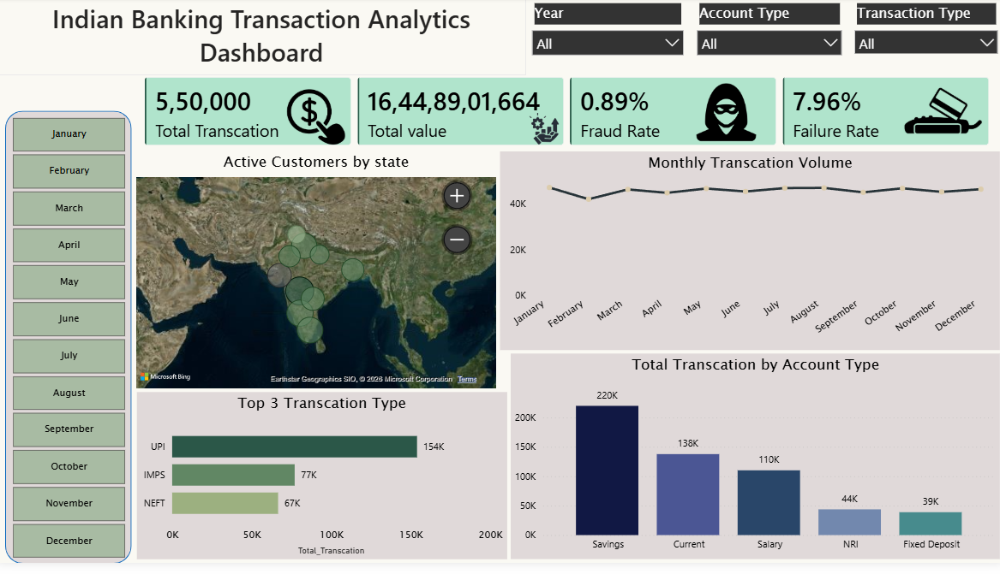
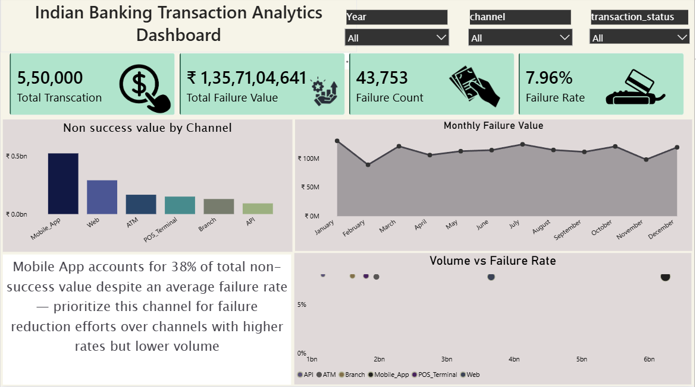
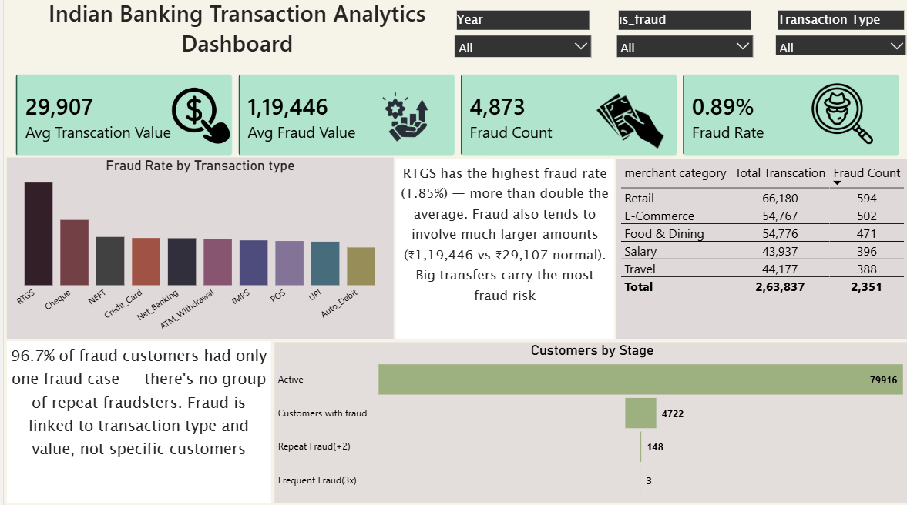

# 🏦 Indian Banking Transaction Analytics Dashboard

An interactive **Power BI dashboard** that analyzes 5,50,000+ Indian banking transactions to surface success/failure patterns, channel performance, and fraud risk — built as an end-to-end BI portfolio project (data modeling → DAX → visualization → insight generation).


---

## 📌 Project Overview

Banks processing UPI, IMPS, NEFT, RTGS, and card transactions handle massive daily volumes, and even small failure or fraud rates translate into large absolute losses. This is a 3-page Power BI report built on an Indian banking transaction dataset to help stakeholders monitor transaction health, pinpoint failure-prone channels, and quantify fraud exposure — turning raw transaction logs into decisions.

## 🎯 Business Problem

A bank's operations & risk teams need answers to questions like:

- What's the overall transaction volume, value, and failure rate?
- Which **channels** (Mobile App, Web, ATM, POS, API) are driving the most failed value — and should be prioritized for fixes?
- Which **transaction types** (UPI, IMPS, NEFT, RTGS, Cards) carry the highest fraud risk?
- Are frauds concentrated in a small group of repeat offenders, or spread across many one-off cases?
- Which **merchant categories** and **account types** contribute the most transaction volume and risk?

This project answers each of these with a dedicated view, backed by DAX measures rather than static numbers.

## 🎯 Objectives

- Consolidate transaction, customer, and fraud data into a single interactive report
- Track transaction volume, value, and success/failure rate over time
- Break down failures by channel to identify where to focus operational fixes
- Quantify fraud rate, fraud value, and repeat-fraud behavior by transaction type and merchant category
- Turn each finding into a plain-language, decision-ready insight (not just a chart)

## 🛠️ Tools & Technologies

- **Power BI Desktop** — data modeling & report building
- **DAX** — KPI and measure calculations
- **Power Query** — data cleaning & transformation
- **Star-schema data modeling** (Date, Fraud Funnel, Transactions tables)
- Excel — source data prep

## 📊 Dashboard Pages

### 1️⃣ Overview
- KPIs: Total Transactions, Total Transaction Value, Fraud Rate, Failure Rate
- Active customers by state (map view)
- Monthly transaction volume trend
- Top transaction types by volume (UPI, IMPS, NEFT)
- Total transactions by account type (Savings, Current, Salary, NRI, Fixed Deposit)
- Slicers: Year, Account Type, Transaction Type

### 2️⃣ Channel & Transaction Status
- KPIs: Total Transactions, Total Failure Value, Failure Count, Failure Rate
- Non-success value by channel (Mobile App, Web, ATM, POS Terminal, Branch, API)
- Monthly failure value trend
- Volume vs. failure rate scatter plot across channels
- Written insight callout on which channel to prioritize for failure reduction
- Slicers: Year, Channel, Transaction Status

### 3️⃣ Fraud & Risk Analysis
- KPIs: Avg Transaction Value, Avg Fraud Value, Fraud Count, Fraud Rate
- Fraud rate by transaction type
- Fraud count & transaction volume by merchant category (table)
- Customer fraud funnel: Active customers → customers with fraud → repeat (2+) → frequent (3x) fraud
- Written insight callouts explaining the "why" behind the numbers
- Slicers: Year, Is Fraud, Transaction Type

## 📈 Key KPIs Tracked

| KPI | Description |
|---|---|
| Total Transactions | Count of all processed transactions |
| Total Transaction Value | Sum value of all transactions |
| Failure Rate / Failure Count | % and count of failed transactions |
| Fraud Rate / Fraud Count | % and count of flagged fraudulent transactions |
| Avg Transaction Value vs Avg Fraud Value | Compares typical transaction size to typical fraud size |
| Repeat Fraud Rate | Share of fraud customers with 2+ / 3+ fraud incidents |

## 🔎 Key Insights

- **Mobile App transactions account for ~38% of total non-success value**, despite not having the single highest failure *rate* — prioritizing this channel for fixes reduces more absolute failure value than chasing higher-rate/lower-volume channels.
- **RTGS has the highest fraud rate (1.85%)** — more than double the average — and fraudulent RTGS transactions also involve materially larger amounts than normal ones.
- **96.7% of fraud customers have only a single fraud incident** — fraud is driven by transaction type and value, not a small ring of repeat offenders, which shapes how a fraud-detection strategy should be designed.
- **UPI dominates transaction volume** among payment types, while **Savings accounts** account for the largest share of transactions by account type.
- Retail, E-commerce, and Food & Dining are the top merchant categories by both transaction volume and fraud count.

## 🚀 Future Improvements

- Connect the report to a live database for real-time monitoring (currently static/imported data)
- Build a predictive (ML) model to flag likely-fraud transactions before completion
- Add customer segmentation (RFM-style) analysis
- Add row-level security for role-based views (e.g., regional managers)

## 📂 Repository Contents

```
indian-banking-transaction-analytics-dashboard/
│
├── README.md
├── Indian_Banking_Transaction_Analytics.pbix                  # Power BI report file
├── /screenshots
│   ├── 01-overview.png
│   ├── 02-channel-transaction-status.png
│   └── 03-fraud-risk-analysis.png
├── /data
│   └── data-dictionary.md         # column/table descriptions (no raw sensitive data)
└── LICENSE
```

## 🖼️ Dashboard Preview

| Overview | Channel & Status | Fraud & Risk |
|---|---|---|
|  |  |  |

## 👩‍💻 Author

**Durga Prasad Chintapalli**
